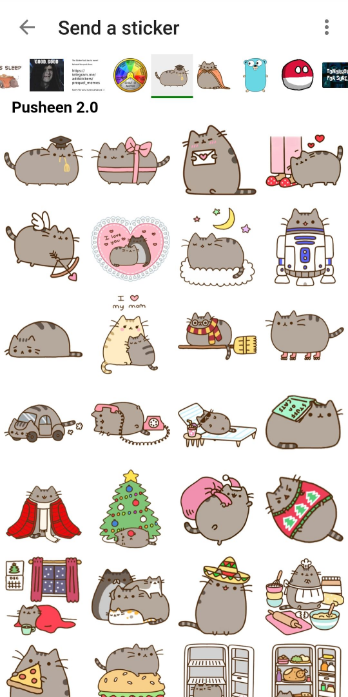
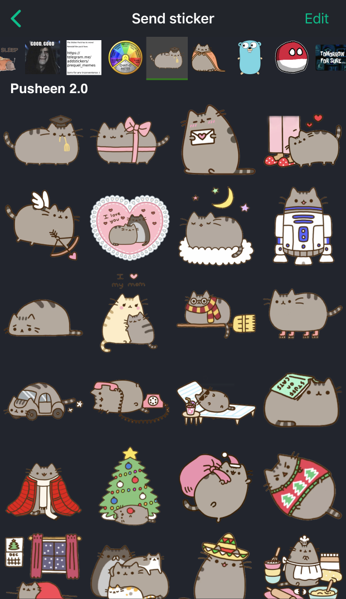

# Maunium sticker picker
A fast and simple Matrix sticker picker widget. Tested on Element Web, Android & iOS.

## Discussion
Matrix room: [`#stickerpicker:maunium.net`](https://matrix.to/#/#stickerpicker:maunium.net)

## Utility commands
In addition to the sticker picker widget itself, this project includes some
utility scripts you can use to import and create sticker packs.

To get started, install the dependencies for using the commands:

0. Make sure you have Python 3.6 or higher.
1. (Optional) Set up a virtual environment.
   1. Create with `virtualenv -p python3 .venv`
   2. Activate with `source .venv/bin/activate`
2. Install the utility commands and their dependencies with `pip install .`

### Importing packs from Telegram
To import packs from Telegram, simply run `sticker-import <pack urls...>` with
one or more t.me/addstickers/... URLs.

If you want to list the URLs of all your saved packs, use `sticker-import --list`.
This requires logging in with your account instead of a bot token.

Notes:

* On the first run, it'll prompt you to log in to Matrix and Telegram.
 * The Matrix URL and access token are stored in `config.json` by default.
 * The Telethon session data is stored in `sticker-import.session` by default.
* By default, the pack data will be written to `web/packs/`.
* You can pass as many pack URLs as you want.
* You can re-run the command with the same URLs to update packs.

### Creating your own packs
1. Create a directory with your sticker images.
   * The file name (excluding extension) will be used as the caption.
   * The directory name will be used as the pack name/ID.
   * If you want the stickers to appear in a specific order, prefix them with
     `number-`, e.g. `01-Cat.png`. The number and dash won't be included in the
     caption.
2. Run `sticker-pack <pack directory>`.
   * If you want to override the pack displayname, pass `--title <custom title>`.
   * Pass `--add-to-index web/packs/` if you want to automatically add the
     generated pack to your sticker picker.

## Enabling the sticker widget
1. Serve everything under `web/` using your webserver of choice. Make sure not
   to serve the top-level data, as `config.json` and the Telethon session file
   contain sensitive data.
2. Using `/devtools` in Element Web, edit the `m.widgets` account data event to
   have the following content:

   ```json
   {
       "stickerpicker": {
           "content": {
               "type": "m.stickerpicker",
               "url": "https://your.sticker.picker.url/?theme=$theme",
               "name": "Stickerpicker",
               "data": {}
           },
           "sender": "@you:picker.url",
           "state_key": "stickerpicker",
           "type": "m.widget",
           "id": "stickerpicker"
       }
   }
   ```

    If you do not yet have a `m.widgets` event, simply create it with that content.
    You can also [use the client-server API directly][1] instead of using Element Web.

    The `theme=$theme` query parameter will make the widget conform to Element's
    theme automatically. You can also use `light`, `dark` or `black` instead of
    `$theme` to always use a specific theme.

    You can use https://maunium.net/stickers-demo/ as the URL to try out the
    picker without hosting the files yourself.
3. Open the sticker picker and enjoy the fast sticker picking experience.

[1]: https://matrix.org/docs/spec/client_server/latest#put-matrix-client-r0-user-userid-account-data-type

## Preview
### Element Web


### Element Android


### Element iOS (dark theme)

